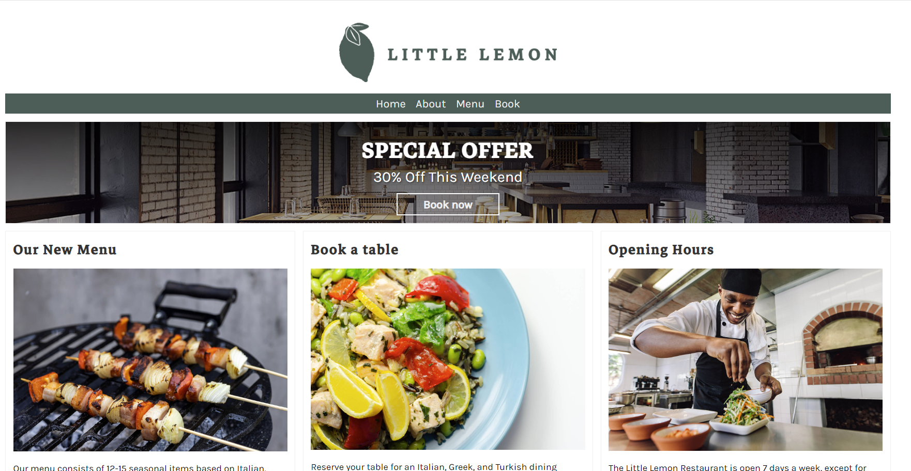
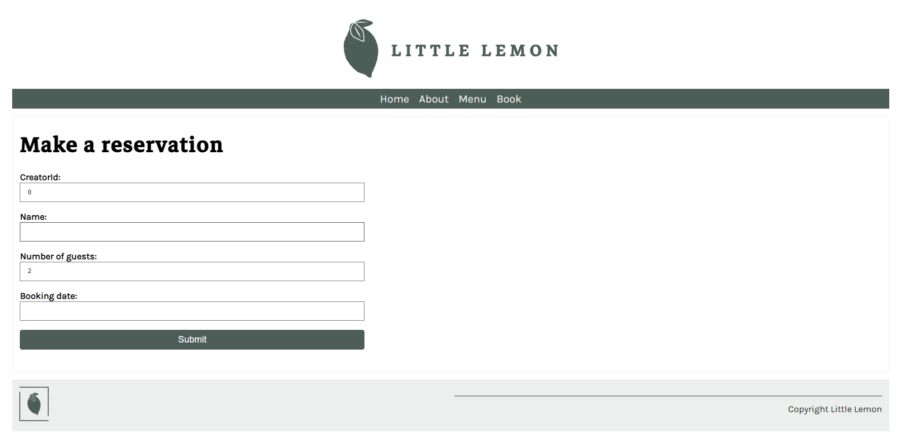
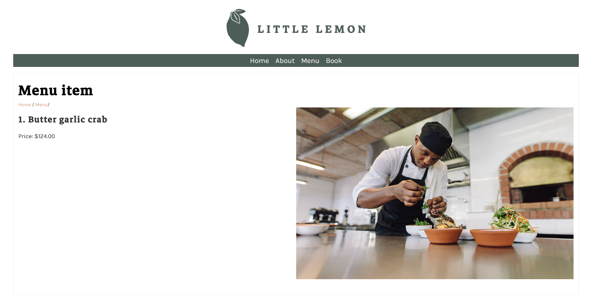

# Meta Backend Capstone

LittleLemon is a full-stack Django resturant web application that leverages Django, REST Framework and Djoser for robust API and full authentication management. Developed with a focus on Scalability , utilized pytest and factory_boy for comprehensive testing.

The app also utilized rest_framework for full CRUD operations with authorization and user permissions.

Here are some screenshots of LittleLemon:

  

  

  

